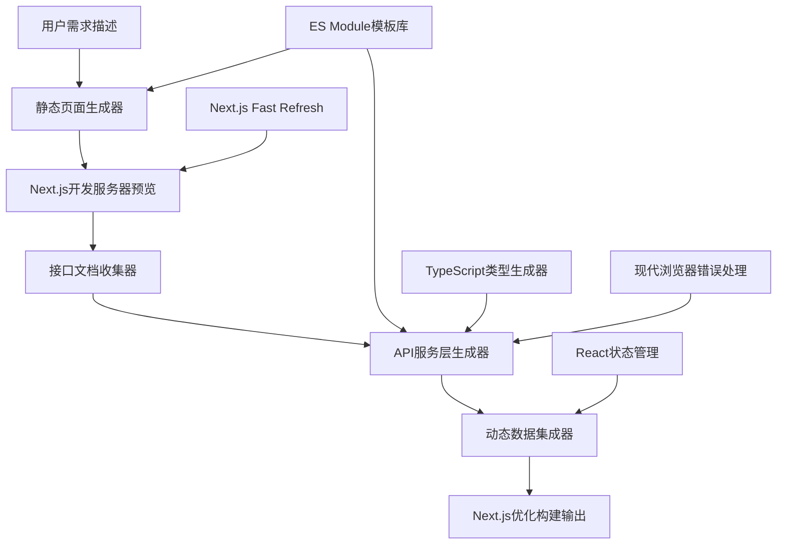
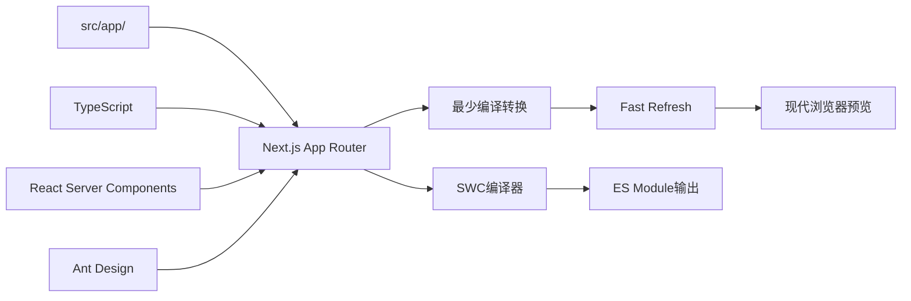

# 设计文档

## 概述

本设计文档描述了AI编程项目模板的架构和实现方案，该模板将指导AI助手按照"静态页面 → 接口文档指导 → 接口集成 → 动态数据加载"的流程创建高质量的Ant Design + Next.js应用。该方案采用Next.js作为全栈框架，专注于ES Module和现代浏览器，通过优化配置实现最少编译的原码开发体验。

## 架构设计

### 整体架构



### Next.js现代化架构



### 核心模块

1. **静态页面生成器** - 基于用户描述生成Ant Design组件页面
2. **接口文档收集器** - 指导用户提供标准化接口文档
3. **API服务层生成器** - 基于接口文档生成类型安全的API服务
4. **动态数据集成器** - 将静态页面转换为动态数据驱动页面
5. **ES Module模板库** - 存储现代化的组件和页面模板
6. **TypeScript类型生成器** - 自动生成类型定义

### Next.js项目结构

```
project/
├── next.config.js          # Next.js配置（现代化优化）
├── tsconfig.json           # TypeScript配置
├── package.json            # 依赖管理
├── src/
│   ├── app/               # App Router目录
│   │   ├── layout.tsx     # 根布局
│   │   ├── page.tsx       # 首页
│   │   ├── users/         # 用户相关页面
│   │   │   ├── page.tsx   # 用户列表页
│   │   │   └── [id]/
│   │   │       └── page.tsx # 用户详情页
│   │   ├── globals.css    # 全局样式
│   │   └── loading.tsx    # 加载组件
│   ├── components/        # 可复用组件
│   │   ├── forms/
│   │   ├── lists/
│   │   └── common/
│   ├── services/          # API服务层
│   │   ├── api.ts
│   │   ├── userService.ts
│   │   └── types.ts
│   ├── hooks/             # 自定义Hooks
│   │   ├── useApi.ts
│   │   └── useLocalStorage.ts
│   ├── utils/             # 工具函数
│   │   ├── request.ts
│   │   └── helpers.ts
│   └── lib/               # 库文件
│       ├── constants.ts
│       └── validations.ts
├── public/                # 静态资源
└── .next/                 # Next.js构建输出
```

## 组件和接口设计

### 1. 静态页面生成器

#### 页面模板结构
```typescript
interface PageTemplate {
  name: string;
  description: string;
  layout: 'basic' | 'dashboard' | 'form' | 'list' | 'detail';
  components: ComponentConfig[];
  metadata: PageMetadata;
  routing: RoutingConfig;
}

interface ComponentConfig {
  type: AntdComponentType;
  props: Record<string, any>;
  children?: ComponentConfig[];
  mockData?: any;
}

interface PageMetadata {
  title: string;
  description: string;
  keywords: string[];
  responsive: boolean;
}

interface RoutingConfig {
  path: string;
  params?: string[];
  lazy?: boolean;
}
```

#### 组件模板库
```typescript
// 基础组件模板 - 使用现代ES Module语法
const COMPONENT_TEMPLATES = {
  // 表单组件
  form: {
    basic: `
import { useState } from 'react';
import { Form, Input, Button, Card } from 'antd';

interface FormProps {
  onSubmit?: (values: any) => void;
  loading?: boolean;
}

export const BasicForm = ({ onSubmit, loading }: FormProps) => {
  const [form] = Form.useForm();

  const handleFinish = (values: any) => {
    onSubmit?.(values);
  };

  return (
    <Card title="表单标题">
      <Form
        form={form}
        layout="vertical"
        onFinish={handleFinish}
        autoComplete="off"
      >
        {/* 表单字段将在这里生成 */}
        <Form.Item>
          <Button type="primary" htmlType="submit" loading={loading}>
            提交
          </Button>
        </Form.Item>
      </Form>
    </Card>
  );
};
    `,
    
    // 列表组件
    list: `
import { Button, Space, Table, Card } from 'antd';
import type { ColumnsType } from 'antd/es/table';

interface ListProps<T> {
  data?: T[];
  loading?: boolean;
  onEdit?: (record: T) => void;
  onDelete?: (record: T) => void;
}

export const BasicList = <T extends Record<string, any>>({ 
  data = [], 
  loading, 
  onEdit, 
  onDelete 
}: ListProps<T>) => {
  const columns: ColumnsType<T> = [
    // 列定义将在这里生成
    {
      title: '操作',
      key: 'action',
      render: (_, record) => (
        <Space size="middle">
          <Button type="link" onClick={() => onEdit?.(record)}>
            编辑
          </Button>
          <Button type="link" danger onClick={() => onDelete?.(record)}>
            删除
          </Button>
        </Space>
      ),
    },
  ];

  return (
    <Card title="列表标题">
      <Table
        columns={columns}
        dataSource={data}
        loading={loading}
        rowKey="id"
        pagination={{
          pageSize: 10,
          showSizeChanger: true,
          showQuickJumper: true,
        }}
      />
    </Card>
  );
};
    `
  }
};
```

### 2. 接口文档收集器

#### 标准接口文档格式
```typescript
interface APIDocumentation {
  baseURL: string;
  authentication?: AuthConfig;
  endpoints: APIEndpoint[];
}

interface APIEndpoint {
  name: string;
  method: 'GET' | 'POST' | 'PUT' | 'DELETE' | 'PATCH';
  path: string;
  description: string;
  parameters?: Parameter[];
  requestBody?: RequestBodySchema;
  responses: ResponseSchema[];
  examples: {
    request?: any;
    response?: any;
  };
}

interface Parameter {
  name: string;
  in: 'query' | 'path' | 'header';
  required: boolean;
  type: string;
  description: string;
  example?: any;
}

interface AuthConfig {
  type: 'bearer' | 'apiKey' | 'basic';
  headerName?: string;
  tokenPrefix?: string;
}
```

#### 文档验证器
```typescript
class APIDocumentationValidator {
  validate(doc: APIDocumentation): ValidationResult {
    const errors: string[] = [];
    
    // 验证基础URL
    if (!doc.baseURL || !this.isValidURL(doc.baseURL)) {
      errors.push('baseURL is required and must be a valid URL');
    }
    
    // 验证端点
    doc.endpoints.forEach((endpoint, index) => {
      if (!endpoint.name) {
        errors.push(`Endpoint ${index}: name is required`);
      }
      if (!endpoint.path) {
        errors.push(`Endpoint ${index}: path is required`);
      }
      if (!endpoint.responses || endpoint.responses.length === 0) {
        errors.push(`Endpoint ${index}: at least one response is required`);
      }
    });
    
    return {
      isValid: errors.length === 0,
      errors
    };
  }
}
```

### 3. API服务层生成器

#### 服务层架构
```typescript
// API客户端基类
class APIClient {
  private baseURL: string;
  private authConfig?: AuthConfig;
  
  constructor(baseURL: string, authConfig?: AuthConfig) {
    this.baseURL = baseURL;
    this.authConfig = authConfig;
  }
  
  private async request<T>(
    method: string,
    path: string,
    options?: RequestOptions
  ): Promise<APIResponse<T>> {
    const url = `${this.baseURL}${path}`;
    const headers = this.buildHeaders(options?.headers);
    
    try {
      const response = await fetch(url, {
        method,
        headers,
        body: options?.body ? JSON.stringify(options.body) : undefined,
      });
      
      if (!response.ok) {
        throw new APIError(response.status, response.statusText);
      }
      
      const data = await response.json();
      return {
        data,
        status: response.status,
        headers: response.headers,
      };
    } catch (error) {
      throw this.handleError(error);
    }
  }
  
  // HTTP方法封装
  async get<T>(path: string, params?: Record<string, any>): Promise<APIResponse<T>> {
    const queryString = params ? this.buildQueryString(params) : '';
    return this.request<T>('GET', `${path}${queryString}`);
  }
  
  async post<T>(path: string, body?: any): Promise<APIResponse<T>> {
    return this.request<T>('POST', path, { body });
  }
  
  async put<T>(path: string, body?: any): Promise<APIResponse<T>> {
    return this.request<T>('PUT', path, { body });
  }
  
  async delete<T>(path: string): Promise<APIResponse<T>> {
    return this.request<T>('DELETE', path);
  }
}

// 服务生成器
class ServiceGenerator {
  generateService(endpoint: APIEndpoint): string {
    const serviceName = this.toPascalCase(endpoint.name);
    const functionName = this.toCamelCase(endpoint.name);
    
    return `
// ${endpoint.description}
export const ${functionName} = async (
  ${this.generateParameters(endpoint)}
): Promise<${this.generateResponseType(endpoint)}> => {
  const response = await apiClient.${endpoint.method.toLowerCase()}<${this.generateResponseType(endpoint)}>(
    '${endpoint.path}'${this.generateRequestBody(endpoint)}
  );
  
  return response.data;
};
    `;
  }
}
```

### 4. 动态数据集成器

#### 状态管理模式
```typescript
// 使用React Query进行数据管理
interface DataHook<T> {
  data: T | undefined;
  loading: boolean;
  error: Error | null;
  refetch: () => void;
}

// 自动生成的数据Hook
const useUserList = (): DataHook<User[]> => {
  const { data, isLoading, error, refetch } = useQuery({
    queryKey: ['users'],
    queryFn: () => getUserList(),
    staleTime: 5 * 60 * 1000, // 5分钟
  });
  
  return {
    data,
    loading: isLoading,
    error,
    refetch,
  };
};

// 页面集成模式
export const UserListPage = () => {
  const { data: users, loading, error, refetch } = useUserList();
  
  if (loading) return <Spin size="large" />;
  if (error) return <Alert message="加载失败" type="error" />;
  
  return (
    <UserList 
      data={users} 
      onRefresh={refetch}
    />
  );
};

// Next.js App Router布局 - src/app/layout.tsx
import { AntdRegistry } from '@ant-design/nextjs-registry';
import { ConfigProvider } from 'antd';
import zhCN from 'antd/locale/zh_CN';
import './globals.css';

export const metadata = {
  title: 'AI Generated App',
  description: 'Created with AI assistance',
};

export default function RootLayout({
  children,
}: {
  children: React.ReactNode;
}) {
  return (
    <html lang="zh">
      <body>
        <AntdRegistry>
          <ConfigProvider locale={zhCN}>
            {children}
          </ConfigProvider>
        </AntdRegistry>
      </body>
    </html>
  );
}
```

## 数据模型

### 类型定义生成
```typescript
// 基于接口文档自动生成类型
interface TypeGenerator {
  generateTypes(schema: ResponseSchema): string;
  generateInterface(name: string, properties: Record<string, any>): string;
  generateEnum(name: string, values: string[]): string;
}

// 示例生成的类型
interface User {
  id: number;
  name: string;
  email: string;
  avatar?: string;
  createdAt: string;
  updatedAt: string;
}

interface CreateUserRequest {
  name: string;
  email: string;
  password: string;
}

interface UpdateUserRequest {
  name?: string;
  email?: string;
  avatar?: string;
}

interface PaginatedResponse<T> {
  data: T[];
  total: number;
  page: number;
  pageSize: number;
}
```

## 错误处理

### 统一错误处理机制
```typescript
// 错误类型定义
class APIError extends Error {
  constructor(
    public status: number,
    public message: string,
    public details?: any
  ) {
    super(message);
    this.name = 'APIError';
  }
}

// 全局错误处理器
class ErrorHandler {
  static handle(error: Error): void {
    if (error instanceof APIError) {
      switch (error.status) {
        case 401:
          message.error('登录已过期，请重新登录');
          // 跳转到登录页
          break;
        case 403:
          message.error('没有权限执行此操作');
          break;
        case 404:
          message.error('请求的资源不存在');
          break;
        case 500:
          message.error('服务器内部错误');
          break;
        default:
          message.error(error.message || '请求失败');
      }
    } else {
      message.error('网络错误，请检查网络连接');
    }
  }
}

// React错误边界
class ErrorBoundary extends React.Component<
  React.PropsWithChildren<{}>,
  { hasError: boolean }
> {
  constructor(props: React.PropsWithChildren<{}>) {
    super(props);
    this.state = { hasError: false };
  }

  static getDerivedStateFromError(error: Error) {
    return { hasError: true };
  }

  componentDidCatch(error: Error, errorInfo: React.ErrorInfo) {
    console.error('Error caught by boundary:', error, errorInfo);
  }

  render() {
    if (this.state.hasError) {
      return (
        <Result
          status="500"
          title="页面出错了"
          subTitle="抱歉，页面发生了错误"
          extra={
            <Button type="primary" onClick={() => window.location.reload()}>
              刷新页面
            </Button>
          }
        />
      );
    }

    return this.props.children;
  }
}
```

## 测试策略

### 组件测试
```typescript
// 组件测试模板
describe('UserForm', () => {
  it('should render form fields correctly', () => {
    render(<UserForm />);
    
    expect(screen.getByLabelText('用户名')).toBeInTheDocument();
    expect(screen.getByLabelText('邮箱')).toBeInTheDocument();
    expect(screen.getByRole('button', { name: '提交' })).toBeInTheDocument();
  });
  
  it('should validate required fields', async () => {
    render(<UserForm />);
    
    fireEvent.click(screen.getByRole('button', { name: '提交' }));
    
    await waitFor(() => {
      expect(screen.getByText('请输入用户名')).toBeInTheDocument();
    });
  });
  
  it('should submit form with valid data', async () => {
    const mockSubmit = jest.fn();
    render(<UserForm onSubmit={mockSubmit} />);
    
    fireEvent.change(screen.getByLabelText('用户名'), {
      target: { value: 'testuser' }
    });
    fireEvent.change(screen.getByLabelText('邮箱'), {
      target: { value: 'test@example.com' }
    });
    
    fireEvent.click(screen.getByRole('button', { name: '提交' }));
    
    await waitFor(() => {
      expect(mockSubmit).toHaveBeenCalledWith({
        name: 'testuser',
        email: 'test@example.com'
      });
    });
  });
});
```

### API测试
```typescript
// API服务测试
describe('UserService', () => {
  beforeEach(() => {
    fetchMock.resetMocks();
  });
  
  it('should fetch user list successfully', async () => {
    const mockUsers = [
      { id: 1, name: 'User 1', email: 'user1@example.com' }
    ];
    
    fetchMock.mockResponseOnce(JSON.stringify(mockUsers));
    
    const users = await getUserList();
    
    expect(users).toEqual(mockUsers);
    expect(fetchMock).toHaveBeenCalledWith('/api/users', {
      method: 'GET',
      headers: expect.any(Object)
    });
  });
  
  it('should handle API errors', async () => {
    fetchMock.mockRejectOnce(new Error('Network error'));
    
    await expect(getUserList()).rejects.toThrow('Network error');
  });
});
```

## 性能优化

### 代码分割和懒加载
```typescript
// Next.js App Router自动代码分割
// src/app/users/page.tsx
import { Suspense } from 'react';
import { Spin } from 'antd';
import { UserList } from '@/components/lists/UserList';

// 组件级懒加载
const LazyUserChart = lazy(() => import('@/components/charts/UserChart'));

export default function UsersPage() {
  return (
    <div>
      <UserList />
      <Suspense fallback={<Spin size="large" />}>
        <LazyUserChart />
      </Suspense>
    </div>
  );
}

// src/app/users/[id]/page.tsx
export default function UserDetailPage({ params }: { params: { id: string } }) {
  return <UserDetail id={params.id} />;
}

// 动态导入组件
const DynamicModal = dynamic(() => import('@/components/modals/UserModal'), {
  loading: () => <Spin />,
  ssr: false, // 客户端渲染
});
```

### 数据缓存策略
```typescript
// React Query配置
const queryClient = new QueryClient({
  defaultOptions: {
    queries: {
      staleTime: 5 * 60 * 1000, // 5分钟
      cacheTime: 10 * 60 * 1000, // 10分钟
      retry: 3,
      refetchOnWindowFocus: false,
    },
  },
});
```

## 部署和构建

### Next.js现代化配置
```javascript
// next.config.js
/** @type {import('next').NextConfig} */
const nextConfig = {
  // 使用SWC编译器（比Babel更快）
  swcMinify: true,
  
  // 现代浏览器优化
  compiler: {
    // 移除console.log（生产环境）
    removeConsole: process.env.NODE_ENV === 'production',
  },
  
  // 实验性功能
  experimental: {
    // 启用App Router
    appDir: true,
    // 优化字体加载
    optimizeFonts: true,
    // 现代化输出
    esmExternals: true,
  },
  
  // 构建优化
  output: 'standalone', // 优化部署
  
  // 现代浏览器支持
  target: 'serverless',
  
  // 环境变量
  env: {
    CUSTOM_KEY: process.env.CUSTOM_KEY,
  },
  
  // 图片优化
  images: {
    formats: ['image/webp', 'image/avif'],
    domains: ['example.com'],
  },
  
  // Webpack配置优化
  webpack: (config, { dev, isServer }) => {
    // 现代浏览器优化
    if (!dev && !isServer) {
      config.resolve.alias = {
        ...config.resolve.alias,
        '@': path.resolve(__dirname, 'src'),
      };
    }
    return config;
  },
};

module.exports = nextConfig;
```

### 构建脚本
```json
{
  "scripts": {
    "dev": "next dev",
    "build": "next build",
    "start": "next start",
    "lint": "next lint",
    "type-check": "tsc --noEmit",
    "build:analyze": "ANALYZE=true next build"
  }
}
```

### 现代浏览器支持配置
```json
// package.json
{
  "browserslist": [
    "Chrome >= 87",
    "Firefox >= 78", 
    "Safari >= 14",
    "Edge >= 87"
  ]
}
```

### TypeScript配置优化
```json
// tsconfig.json
{
  "compilerOptions": {
    "target": "ES2022",
    "lib": ["dom", "dom.iterable", "esnext"],
    "allowJs": true,
    "skipLibCheck": true,
    "strict": true,
    "noEmit": true,
    "esModuleInterop": true,
    "module": "esnext",
    "moduleResolution": "bundler",
    "resolveJsonModule": true,
    "isolatedModules": true,
    "jsx": "preserve",
    "incremental": true,
    "plugins": [
      {
        "name": "next"
      }
    ],
    "paths": {
      "@/*": ["./src/*"]
    }
  },
  "include": ["next-env.d.ts", "**/*.ts", "**/*.tsx", ".next/types/**/*.ts"],
  "exclude": ["node_modules"]
}
```

### 现代化部署优化
```dockerfile
# Dockerfile - 多阶段构建
FROM node:18-alpine AS base

# 依赖安装阶段
FROM base AS deps
WORKDIR /app
COPY package.json package-lock.json ./
RUN npm ci --only=production

# 构建阶段
FROM base AS builder
WORKDIR /app
COPY . .
RUN npm run build

# 运行阶段
FROM base AS runner
WORKDIR /app
ENV NODE_ENV production
COPY --from=builder /app/.next/standalone ./
COPY --from=builder /app/.next/static ./.next/static
EXPOSE 3000
CMD ["node", "server.js"]
```