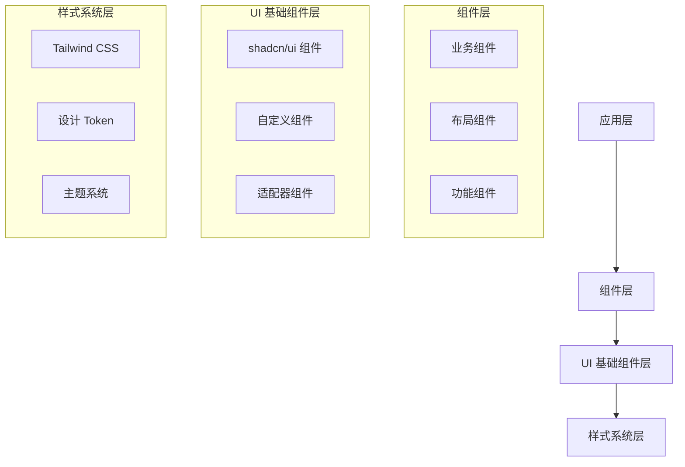
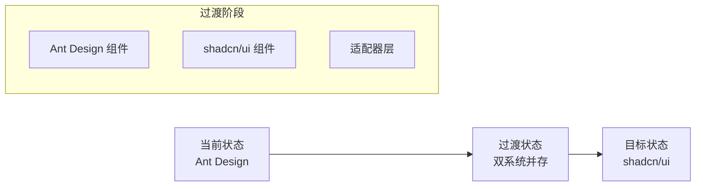

# shadcn/ui + Tailwind CSS 迁移设计文档

## 概述

本设计文档详细描述了从 Ant Design 到 shadcn/ui + Tailwind CSS 的迁移架构设计。迁移将采用渐进式策略，确保系统稳定性和开发效率。

## 架构设计

### 整体架构



### 迁移策略架构



## 组件设计

### 基础组件映射

| Ant Design | shadcn/ui | 迁移复杂度 | 备注 |
|------------|-----------|------------|------|
| Button | Button | 低 | 直接映射 |
| Input | Input | 低 | API 相似 |
| Card | Card | 低 | 结构相似 |
| Modal | Dialog | 中 | API 差异较大 |
| Table | Table | 高 | 功能复杂 |
| Form | Form | 高 | 需要重新设计 |
| DatePicker | Calendar + Popover | 高 | 需要组合实现 |
| Select | Select | 中 | 功能相似 |
| Drawer | Sheet | 中 | API 略有差异 |
| Tooltip | Tooltip | 低 | 直接映射 |

### 组件架构设计

```typescript
// 组件基础接口
interface BaseComponentProps {
  className?: string;
  children?: React.ReactNode;
  variant?: string;
  size?: 'sm' | 'md' | 'lg';
}

// 组件变体系统
interface ComponentVariants {
  variants: {
    variant: Record<string, string>;
    size: Record<string, string>;
  };
  defaultVariants: {
    variant: string;
    size: string;
  };
}
```

### 适配器模式设计

```typescript
// Ant Design 到 shadcn/ui 适配器
interface ComponentAdapter<AntProps, ShadcnProps> {
  adapt(antProps: AntProps): ShadcnProps;
  reverse?(shadcnProps: ShadcnProps): AntProps;
}

// 示例：Button 适配器
class ButtonAdapter implements ComponentAdapter<AntButtonProps, ShadcnButtonProps> {
  adapt(antProps: AntButtonProps): ShadcnButtonProps {
    return {
      variant: this.mapVariant(antProps.type),
      size: this.mapSize(antProps.size),
      disabled: antProps.disabled,
      children: antProps.children,
    };
  }
}
```

## 样式系统设计

### Tailwind CSS 配置

```javascript
// tailwind.config.js
module.exports = {
  content: ['./src/**/*.{js,ts,jsx,tsx}'],
  theme: {
    extend: {
      colors: {
        // 设计 token 颜色系统
        primary: {
          50: '#eff6ff',
          500: '#3b82f6',
          900: '#1e3a8a',
        },
        // 语义化颜色
        success: 'hsl(var(--success))',
        warning: 'hsl(var(--warning))',
        error: 'hsl(var(--error))',
      },
      spacing: {
        // 间距系统
        '18': '4.5rem',
        '88': '22rem',
      },
      fontFamily: {
        // 字体系统
        sans: ['Inter', 'system-ui', 'sans-serif'],
        mono: ['JetBrains Mono', 'monospace'],
      },
    },
  },
  plugins: [
    require('@tailwindcss/typography'),
    require('@tailwindcss/forms'),
  ],
};
```

### CSS 变量系统

```css
/* globals.css */
:root {
  /* 颜色变量 */
  --primary: 221 83% 53%;
  --primary-foreground: 210 40% 98%;
  --secondary: 210 40% 96%;
  --secondary-foreground: 222.2 84% 4.9%;
  
  /* 间距变量 */
  --spacing-xs: 0.25rem;
  --spacing-sm: 0.5rem;
  --spacing-md: 1rem;
  --spacing-lg: 1.5rem;
  --spacing-xl: 2rem;
  
  /* 圆角变量 */
  --radius: 0.5rem;
  --radius-sm: 0.25rem;
  --radius-lg: 0.75rem;
}

.dark {
  --primary: 217 91% 60%;
  --primary-foreground: 222.2 84% 4.9%;
  /* 暗色模式变量 */
}
```

### 组件变体系统

```typescript
// 使用 class-variance-authority
import { cva, type VariantProps } from 'class-variance-authority';

const buttonVariants = cva(
  'inline-flex items-center justify-center rounded-md text-sm font-medium transition-colors focus-visible:outline-none focus-visible:ring-2 focus-visible:ring-ring focus-visible:ring-offset-2 disabled:opacity-50 disabled:pointer-events-none ring-offset-background',
  {
    variants: {
      variant: {
        default: 'bg-primary text-primary-foreground hover:bg-primary/90',
        destructive: 'bg-destructive text-destructive-foreground hover:bg-destructive/90',
        outline: 'border border-input hover:bg-accent hover:text-accent-foreground',
        secondary: 'bg-secondary text-secondary-foreground hover:bg-secondary/80',
        ghost: 'hover:bg-accent hover:text-accent-foreground',
        link: 'underline-offset-4 hover:underline text-primary',
      },
      size: {
        default: 'h-10 py-2 px-4',
        sm: 'h-9 px-3 rounded-md',
        lg: 'h-11 px-8 rounded-md',
      },
    },
    defaultVariants: {
      variant: 'default',
      size: 'default',
    },
  }
);
```

## 数据模型

### 主题配置模型

```typescript
interface ThemeConfig {
  colors: {
    primary: ColorScale;
    secondary: ColorScale;
    accent: ColorScale;
    neutral: ColorScale;
    semantic: {
      success: string;
      warning: string;
      error: string;
      info: string;
    };
  };
  spacing: SpacingScale;
  typography: TypographyScale;
  borderRadius: RadiusScale;
  shadows: ShadowScale;
}

interface ColorScale {
  50: string;
  100: string;
  200: string;
  300: string;
  400: string;
  500: string;
  600: string;
  700: string;
  800: string;
  900: string;
}
```

### 组件配置模型

```typescript
interface ComponentConfig {
  name: string;
  variants: Record<string, string>;
  defaultProps: Record<string, any>;
  styles: {
    base: string;
    variants: Record<string, Record<string, string>>;
  };
}

interface MigrationConfig {
  components: ComponentConfig[];
  mappings: ComponentMapping[];
  deprecations: DeprecationWarning[];
}
```

## 错误处理

### 迁移错误处理

```typescript
class MigrationError extends Error {
  constructor(
    message: string,
    public component: string,
    public phase: 'mapping' | 'styling' | 'testing'
  ) {
    super(message);
    this.name = 'MigrationError';
  }
}

interface ErrorHandler {
  handleMappingError(error: MigrationError): void;
  handleStylingError(error: MigrationError): void;
  handleTestingError(error: MigrationError): void;
  reportProgress(phase: string, progress: number): void;
}
```

### 兼容性检查

```typescript
interface CompatibilityChecker {
  checkComponentCompatibility(component: string): CompatibilityResult;
  checkStyleCompatibility(styles: string[]): CompatibilityResult;
  checkAPICompatibility(api: ComponentAPI): CompatibilityResult;
}

interface CompatibilityResult {
  compatible: boolean;
  warnings: string[];
  errors: string[];
  suggestions: string[];
}
```

## 测试策略

### 视觉回归测试

```typescript
interface VisualTestConfig {
  components: string[];
  viewports: Viewport[];
  themes: Theme[];
  scenarios: TestScenario[];
}

interface TestScenario {
  name: string;
  props: Record<string, any>;
  interactions?: Interaction[];
}
```

### 性能测试

```typescript
interface PerformanceMetrics {
  bundleSize: {
    before: number;
    after: number;
    reduction: number;
  };
  renderTime: {
    before: number;
    after: number;
    improvement: number;
  };
  memoryUsage: {
    before: number;
    after: number;
    reduction: number;
  };
}
```

## 迁移工具设计

### CLI 工具架构

```typescript
interface MigrationCLI {
  commands: {
    init(): void;
    add(component: string): void;
    migrate(component: string): void;
    validate(): void;
    rollback(component: string): void;
  };
}

interface ComponentGenerator {
  generateComponent(config: ComponentConfig): string;
  generateStyles(config: StyleConfig): string;
  generateTests(config: TestConfig): string;
}
```

### 代码转换器

```typescript
interface CodeTransformer {
  transformImports(code: string): string;
  transformProps(code: string): string;
  transformStyles(code: string): string;
  transformTests(code: string): string;
}

interface TransformRule {
  pattern: RegExp;
  replacement: string | ((match: string) => string);
  description: string;
}
```

## 部署和监控

### 渐进式部署

```typescript
interface DeploymentStrategy {
  phases: DeploymentPhase[];
  rollbackPlan: RollbackPlan;
  monitoring: MonitoringConfig;
}

interface DeploymentPhase {
  name: string;
  components: string[];
  percentage: number;
  criteria: SuccessCriteria;
}
```

### 监控指标

```typescript
interface MigrationMetrics {
  performance: PerformanceMetrics;
  errors: ErrorMetrics;
  adoption: AdoptionMetrics;
  feedback: UserFeedback;
}

interface ErrorMetrics {
  migrationErrors: number;
  runtimeErrors: number;
  styleErrors: number;
  testFailures: number;
}
```

## 文档系统

### 组件文档结构

```typescript
interface ComponentDocumentation {
  name: string;
  description: string;
  examples: CodeExample[];
  api: APIDocumentation;
  migration: MigrationGuide;
  accessibility: AccessibilityGuide;
}

interface MigrationGuide {
  from: string;
  to: string;
  steps: MigrationStep[];
  codeExamples: BeforeAfterExample[];
  commonIssues: Issue[];
}
```

## 性能优化

### 构建优化

```typescript
interface BuildOptimization {
  treeshaking: {
    enabled: boolean;
    preserveDirectives: string[];
  };
  purgeCSS: {
    enabled: boolean;
    safelist: string[];
  };
  compression: {
    css: boolean;
    js: boolean;
  };
}
```

### 运行时优化

```typescript
interface RuntimeOptimization {
  lazyLoading: {
    components: string[];
    threshold: number;
  };
  caching: {
    styles: boolean;
    components: boolean;
  };
  prefetching: {
    critical: string[];
    deferred: string[];
  };
}
```

## 安全考虑

### CSS 安全

```typescript
interface SecurityConfig {
  csp: {
    styleSrc: string[];
    fontSrc: string[];
  };
  sanitization: {
    allowedClasses: RegExp[];
    blockedClasses: RegExp[];
  };
}
```

## 总结

本设计文档提供了完整的迁移架构，包括组件映射、样式系统、错误处理、测试策略、工具设计等各个方面。设计采用渐进式迁移策略，确保系统稳定性和可维护性。