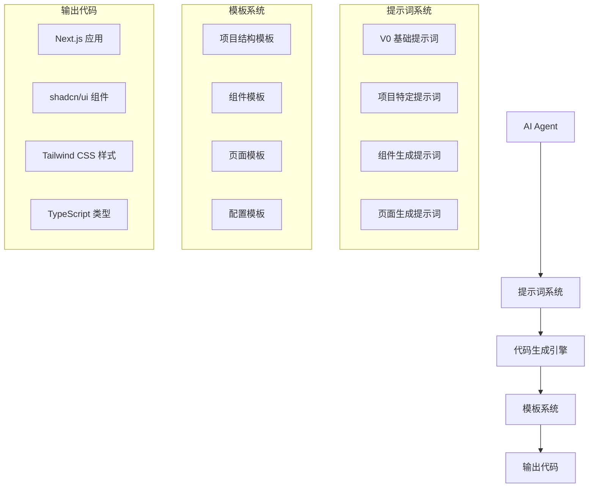
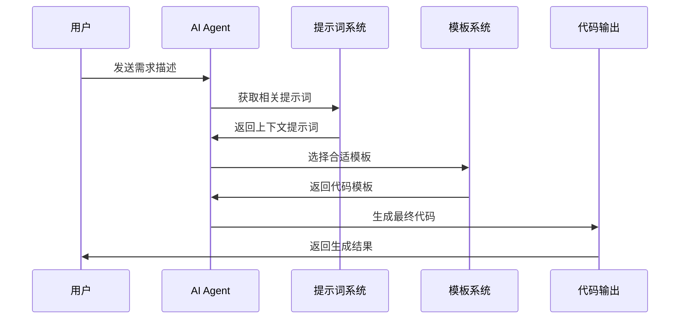

# AI Agent 编码模板设计文档

## 概述

本设计文档描述了为 AI Agent 创建的 Next.js + shadcn/ui + Tailwind CSS 编码模板架构。该模板旨在为 AI Agent 提供标准化的项目结构、组件库和内置提示词系统，使 AI Agent 能够快速生成高质量、一致性的 Web 应用代码。

## 核心目标

1. **AI Agent 友好**：为 AI 代码生成优化的项目结构和组件设计
2. **快速初始化**：提供完整的项目模板，支持一键初始化
3. **内置提示词**：集成基于 V0 规范的 AI 提示词系统
4. **高质量输出**：确保 AI 生成的代码符合最佳实践和项目规范

## 架构设计

### AI Agent 编码模板架构



### 项目结构设计

```
ai-coding-template/
├── .kiro/                          # Kiro 配置
│   ├── steering/                   # AI 指导规则
│   │   ├── coding-standards.md     # 编码规范
│   │   ├── component-patterns.md   # 组件模式
│   │   └── ai-prompts.md          # AI 提示词
│   └── settings/
├── src/
│   ├── app/                        # Next.js App Router
│   ├── components/                 # 组件库
│   │   ├── ui/                    # shadcn/ui 基础组件
│   │   ├── common/                # 通用组件
│   │   ├── forms/                 # 表单组件
│   │   ├── layouts/               # 布局组件
│   │   └── templates/             # AI 生成模板
│   ├── lib/                       # 工具库
│   │   ├── utils.ts              # 通用工具
│   │   ├── ai-helpers.ts         # AI 辅助函数
│   │   └── prompts/              # 提示词库
│   ├── hooks/                     # React Hooks
│   ├── types/                     # TypeScript 类型
│   └── styles/                    # 样式文件
├── docs/                          # 文档
│   ├── ai-usage.md               # AI 使用指南
│   ├── component-guide.md        # 组件指南
│   └── examples/                 # 示例代码
└── templates/                     # 代码模板
    ├── components/               # 组件模板
    ├── pages/                   # 页面模板
    └── prompts/                 # 提示词模板
```

## AI 提示词系统设计

### 基于 V0 的提示词架构

参考 [V0 系统提示词](https://github.com/2-fly-4-ai/V0-system-prompt/)，设计分层的提示词系统：

| 提示词类型 | 作用范围 | AI Agent 使用场景 | 优先级 |
|------------|----------|-------------------|--------|
| 系统级提示词 | 全局规范 | 项目初始化、架构设计 | 最高 |
| 组件级提示词 | 单个组件 | 组件生成、修改 | 高 |
| 页面级提示词 | 页面构建 | 页面生成、布局设计 | 高 |
| 样式提示词 | 样式规范 | CSS 类生成、主题应用 | 中 |
| 交互提示词 | 用户交互 | 事件处理、状态管理 | 中 |
| 性能提示词 | 优化建议 | 代码优化、性能提升 | 低 |

### AI Agent 代码生成流程



### AI 友好的组件设计

```typescript
// AI Agent 组件生成接口
interface AIComponentConfig {
  name: string;
  type: 'ui' | 'layout' | 'form' | 'data';
  props: ComponentPropDefinition[];
  variants: VariantDefinition[];
  examples: CodeExample[];
  prompts: ComponentPrompts;
}

// 组件属性定义（AI 可理解）
interface ComponentPropDefinition {
  name: string;
  type: string;
  required: boolean;
  description: string;
  defaultValue?: any;
  examples: any[];
}

// AI 提示词配置
interface ComponentPrompts {
  generation: string;      // 组件生成提示词
  modification: string;    // 组件修改提示词
  styling: string;        // 样式应用提示词
  testing: string;        // 测试生成提示词
}
```

### 模板系统设计

```typescript
// 代码模板接口
interface CodeTemplate {
  id: string;
  name: string;
  category: 'component' | 'page' | 'hook' | 'utility';
  template: string;
  variables: TemplateVariable[];
  prompts: TemplatePrompts;
}

// 模板变量定义
interface TemplateVariable {
  name: string;
  type: 'string' | 'boolean' | 'array' | 'object';
  description: string;
  defaultValue?: any;
  validation?: ValidationRule[];
}

// AI 模板生成器
class AITemplateGenerator {
  generateComponent(config: AIComponentConfig): string;
  generatePage(layout: PageLayout, components: string[]): string;
  generateHook(functionality: HookConfig): string;
  applyPrompts(template: string, prompts: TemplatePrompts): string;
}
```

## AI 提示词集成设计

### V0 提示词适配

基于 [V0 系统提示词](https://github.com/2-fly-4-ai/V0-system-prompt/) 的核心原则：

```typescript
// V0 提示词配置
interface V0PromptConfig {
  systemPrompt: string;           // 系统级提示词
  componentPrompts: {             // 组件生成提示词
    ui: string;
    layout: string;
    form: string;
    data: string;
  };
  stylePrompts: {                 // 样式相关提示词
    tailwind: string;
    responsive: string;
    darkMode: string;
    accessibility: string;
  };
  codeQuality: {                  // 代码质量提示词
    typescript: string;
    testing: string;
    performance: string;
    security: string;
  };
}

// AI 上下文管理器
class AIContextManager {
  private prompts: V0PromptConfig;
  private projectContext: ProjectContext;
  
  getSystemPrompt(): string;
  getComponentPrompt(type: ComponentType): string;
  getStylePrompt(context: StyleContext): string;
  buildFullPrompt(userRequest: string): string;
}
```

### 内置提示词库

```typescript
// 提示词库结构
const BUILTIN_PROMPTS = {
  // 基础系统提示词（基于 V0）
  system: `
你是一个专业的 React + Next.js + TypeScript 开发专家。
使用 shadcn/ui + Tailwind CSS 技术栈。
遵循以下原则：
1. 优先使用 shadcn/ui 组件
2. 使用 Tailwind CSS 进行样式设计
3. 确保 TypeScript 类型安全
4. 实现可访问性标准
5. 考虑性能优化
  `,
  
  // 组件生成提示词
  component: {
    button: `创建一个 Button 组件，使用 shadcn/ui Button 作为基础...`,
    form: `创建一个表单组件，使用 React Hook Form + Zod 验证...`,
    table: `创建一个数据表格，使用 shadcn/ui Table + TanStack Table...`,
  },
  
  // 页面生成提示词
  page: {
    dashboard: `创建一个仪表板页面，包含统计卡片、图表和数据表格...`,
    form: `创建一个表单页面，包含验证、提交和错误处理...`,
    list: `创建一个列表页面，包含搜索、筛选和分页功能...`,
  }
};
```

### CSS 变量系统

```css
/* globals.css */
:root {
  /* 颜色变量 */
  --primary: 221 83% 53%;
  --primary-foreground: 210 40% 98%;
  --secondary: 210 40% 96%;
  --secondary-foreground: 222.2 84% 4.9%;
  
  /* 间距变量 */
  --spacing-xs: 0.25rem;
  --spacing-sm: 0.5rem;
  --spacing-md: 1rem;
  --spacing-lg: 1.5rem;
  --spacing-xl: 2rem;
  
  /* 圆角变量 */
  --radius: 0.5rem;
  --radius-sm: 0.25rem;
  --radius-lg: 0.75rem;
}

.dark {
  --primary: 217 91% 60%;
  --primary-foreground: 222.2 84% 4.9%;
  /* 暗色模式变量 */
}
```

### 组件变体系统

```typescript
// 使用 class-variance-authority
import { cva, type VariantProps } from 'class-variance-authority';

const buttonVariants = cva(
  'inline-flex items-center justify-center rounded-md text-sm font-medium transition-colors focus-visible:outline-none focus-visible:ring-2 focus-visible:ring-ring focus-visible:ring-offset-2 disabled:opacity-50 disabled:pointer-events-none ring-offset-background',
  {
    variants: {
      variant: {
        default: 'bg-primary text-primary-foreground hover:bg-primary/90',
        destructive: 'bg-destructive text-destructive-foreground hover:bg-destructive/90',
        outline: 'border border-input hover:bg-accent hover:text-accent-foreground',
        secondary: 'bg-secondary text-secondary-foreground hover:bg-secondary/80',
        ghost: 'hover:bg-accent hover:text-accent-foreground',
        link: 'underline-offset-4 hover:underline text-primary',
      },
      size: {
        default: 'h-10 py-2 px-4',
        sm: 'h-9 px-3 rounded-md',
        lg: 'h-11 px-8 rounded-md',
      },
    },
    defaultVariants: {
      variant: 'default',
      size: 'default',
    },
  }
);
```

## 数据模型

### 主题配置模型

```typescript
interface ThemeConfig {
  colors: {
    primary: ColorScale;
    secondary: ColorScale;
    accent: ColorScale;
    neutral: ColorScale;
    semantic: {
      success: string;
      warning: string;
      error: string;
      info: string;
    };
  };
  spacing: SpacingScale;
  typography: TypographyScale;
  borderRadius: RadiusScale;
  shadows: ShadowScale;
}

interface ColorScale {
  50: string;
  100: string;
  200: string;
  300: string;
  400: string;
  500: string;
  600: string;
  700: string;
  800: string;
  900: string;
}
```

### 组件配置模型

```typescript
interface ComponentConfig {
  name: string;
  variants: Record<string, string>;
  defaultProps: Record<string, any>;
  styles: {
    base: string;
    variants: Record<string, Record<string, string>>;
  };
}

interface MigrationConfig {
  components: ComponentConfig[];
  mappings: ComponentMapping[];
  deprecations: DeprecationWarning[];
}
```

## 错误处理

### 迁移错误处理

```typescript
class MigrationError extends Error {
  constructor(
    message: string,
    public component: string,
    public phase: 'mapping' | 'styling' | 'testing'
  ) {
    super(message);
    this.name = 'MigrationError';
  }
}

interface ErrorHandler {
  handleMappingError(error: MigrationError): void;
  handleStylingError(error: MigrationError): void;
  handleTestingError(error: MigrationError): void;
  reportProgress(phase: string, progress: number): void;
}
```

### 兼容性检查

```typescript
interface CompatibilityChecker {
  checkComponentCompatibility(component: string): CompatibilityResult;
  checkStyleCompatibility(styles: string[]): CompatibilityResult;
  checkAPICompatibility(api: ComponentAPI): CompatibilityResult;
}

interface CompatibilityResult {
  compatible: boolean;
  warnings: string[];
  errors: string[];
  suggestions: string[];
}
```

## 测试策略

### 视觉回归测试

```typescript
interface VisualTestConfig {
  components: string[];
  viewports: Viewport[];
  themes: Theme[];
  scenarios: TestScenario[];
}

interface TestScenario {
  name: string;
  props: Record<string, any>;
  interactions?: Interaction[];
}
```

### 性能测试

```typescript
interface PerformanceMetrics {
  bundleSize: {
    before: number;
    after: number;
    reduction: number;
  };
  renderTime: {
    before: number;
    after: number;
    improvement: number;
  };
  memoryUsage: {
    before: number;
    after: number;
    reduction: number;
  };
}
```

## 迁移工具设计

### CLI 工具架构

```typescript
interface MigrationCLI {
  commands: {
    init(): void;
    add(component: string): void;
    migrate(component: string): void;
    validate(): void;
    rollback(component: string): void;
  };
}

interface ComponentGenerator {
  generateComponent(config: ComponentConfig): string;
  generateStyles(config: StyleConfig): string;
  generateTests(config: TestConfig): string;
}
```

### 代码转换器

```typescript
interface CodeTransformer {
  transformImports(code: string): string;
  transformProps(code: string): string;
  transformStyles(code: string): string;
  transformTests(code: string): string;
}

interface TransformRule {
  pattern: RegExp;
  replacement: string | ((match: string) => string);
  description: string;
}
```

## 部署和监控

### 渐进式部署

```typescript
interface DeploymentStrategy {
  phases: DeploymentPhase[];
  rollbackPlan: RollbackPlan;
  monitoring: MonitoringConfig;
}

interface DeploymentPhase {
  name: string;
  components: string[];
  percentage: number;
  criteria: SuccessCriteria;
}
```

### 监控指标

```typescript
interface MigrationMetrics {
  performance: PerformanceMetrics;
  errors: ErrorMetrics;
  adoption: AdoptionMetrics;
  feedback: UserFeedback;
}

interface ErrorMetrics {
  migrationErrors: number;
  runtimeErrors: number;
  styleErrors: number;
  testFailures: number;
}
```

## 文档系统

### 组件文档结构

```typescript
interface ComponentDocumentation {
  name: string;
  description: string;
  examples: CodeExample[];
  api: APIDocumentation;
  migration: MigrationGuide;
  accessibility: AccessibilityGuide;
}

interface MigrationGuide {
  from: string;
  to: string;
  steps: MigrationStep[];
  codeExamples: BeforeAfterExample[];
  commonIssues: Issue[];
}
```

## 性能优化

### 构建优化

```typescript
interface BuildOptimization {
  treeshaking: {
    enabled: boolean;
    preserveDirectives: string[];
  };
  purgeCSS: {
    enabled: boolean;
    safelist: string[];
  };
  compression: {
    css: boolean;
    js: boolean;
  };
}
```

### 运行时优化

```typescript
interface RuntimeOptimization {
  lazyLoading: {
    components: string[];
    threshold: number;
  };
  caching: {
    styles: boolean;
    components: boolean;
  };
  prefetching: {
    critical: string[];
    deferred: string[];
  };
}
```

## 安全考虑

### CSS 安全

```typescript
interface SecurityConfig {
  csp: {
    styleSrc: string[];
    fontSrc: string[];
  };
  sanitization: {
    allowedClasses: RegExp[];
    blockedClasses: RegExp[];
  };
}
```

## 总结

本设计文档提供了完整的迁移架构，包括组件映射、样式系统、错误处理、测试策略、工具设计等各个方面。设计采用渐进式迁移策略，确保系统稳定性和可维护性。