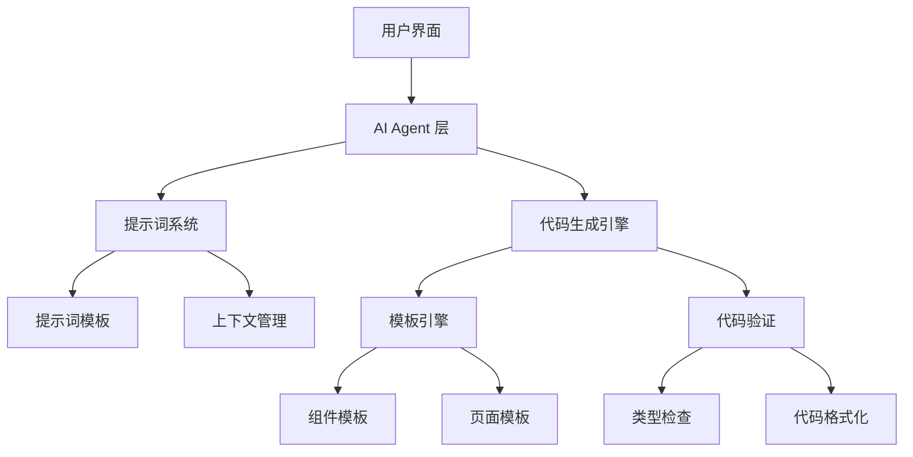
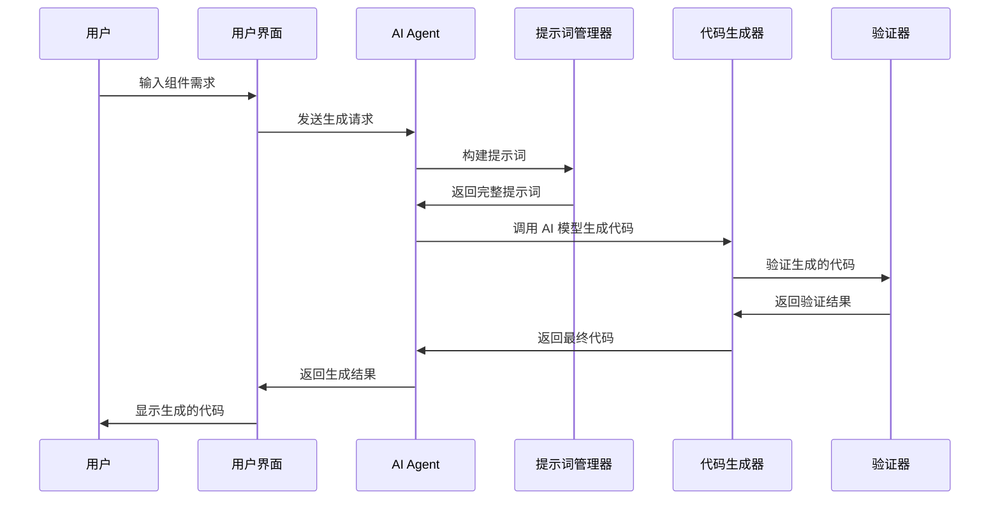

# 开发者指南

本指南为开发者提供深入的技术文档，包括架构设计、API 参考、扩展指南等内容。

## 目录

- [项目架构](#项目架构)
- [核心概念](#核心概念)
- [API 参考](#api-参考)
- [扩展开发](#扩展开发)
- [性能优化](#性能优化)
- [调试指南](#调试指南)
- [部署指南](#部署指南)

## 项目架构

### 整体架构



### 目录结构

```
src/
├── app/                    # Next.js App Router
│   ├── api/               # API 路由
│   ├── examples/          # 示例页面
│   └── globals.css        # 全局样式
├── components/            # React 组件
│   ├── ui/               # 基础 UI 组件
│   ├── examples/         # 示例组件
│   ├── forms/            # 表单组件
│   └── layouts/          # 布局组件
├── lib/                  # 工具库
│   ├── prompts/          # 提示词系统
│   ├── ai-*.ts           # AI 相关功能
│   └── utils.ts          # 通用工具
├── hooks/                # React Hooks
├── types/                # TypeScript 类型定义
└── styles/               # 样式文件
```

### 技术栈

| 层级 | 技术 | 用途 |
|------|------|------|
| 前端框架 | Next.js 14 | React 全栈框架 |
| UI 组件 | shadcn/ui | 组件库 |
| 样式 | Tailwind CSS | 原子化 CSS |
| 类型系统 | TypeScript | 静态类型检查 |
| 状态管理 | Zustand | 轻量级状态管理 |
| 表单处理 | React Hook Form | 表单状态管理 |
| 数据验证 | Zod | 运行时类型验证 |
| 测试 | Vitest + Testing Library | 单元和集成测试 |

## 核心概念

### AI Agent 系统

AI Agent 系统是项目的核心，负责代码生成和智能提示。

```typescript
// src/lib/ai-integration-api.ts
export class AIIntegrationAPI {
  private config: AIConfig;
  private promptManager: PromptManager;
  private codeGenerator: CodeGenerator;

  constructor(config: AIConfig) {
    this.config = config;
    this.promptManager = new PromptManager(config.prompts);
    this.codeGenerator = new CodeGenerator(config.templates);
  }

  async generateComponent(request: ComponentRequest): Promise<GeneratedCode> {
    // 1. 构建提示词
    const prompt = await this.promptManager.buildPrompt(request);
    
    // 2. 调用 AI 模型
    const response = await this.callAIModel(prompt);
    
    // 3. 验证和格式化代码
    const validatedCode = await this.codeGenerator.validate(response);
    
    return validatedCode;
  }
}
```

### 提示词系统

提示词系统管理 AI 生成代码的指令和上下文。

```typescript
// src/lib/prompts/prompt-manager.ts
export class PromptManager {
  private templates: Map<string, PromptTemplate>;
  private contextBuilder: ContextBuilder;

  buildPrompt(request: GenerationRequest): Promise<string> {
    const basePrompt = this.templates.get(request.type);
    const context = this.contextBuilder.build(request);
    
    return this.combinePrompts(basePrompt, context, request);
  }

  private combinePrompts(
    base: PromptTemplate,
    context: ProjectContext,
    request: GenerationRequest
  ): string {
    return `
      ${base.system}
      
      项目上下文：
      ${context.projectInfo}
      
      用户请求：
      ${request.description}
      
      ${base.instructions}
    `;
  }
}
```

### 组件生成流程



## API 参考

### AI Integration API

#### `generateComponent(request: ComponentRequest)`

生成 React 组件代码。

**参数:**
```typescript
interface ComponentRequest {
  name: string;                    // 组件名称
  type: 'ui' | 'form' | 'layout'; // 组件类型
  props: PropDefinition[];         // 属性定义
  features: string[];              // 功能特性
  context?: ProjectContext;        // 项目上下文
}

interface PropDefinition {
  name: string;
  type: string;
  required: boolean;
  description: string;
  defaultValue?: any;
}
```

**返回值:**
```typescript
interface GeneratedCode {
  code: string;           // 生成的代码
  types: string;          // 类型定义
  tests: string;          // 测试代码
  documentation: string;  // 文档
  metadata: CodeMetadata; // 元数据
}
```

**示例:**
```typescript
const aiAPI = new AIIntegrationAPI({
  apiKey: process.env.OPENAI_API_KEY,
  model: 'gpt-4'
});

const result = await aiAPI.generateComponent({
  name: 'UserCard',
  type: 'ui',
  props: [
    {
      name: 'user',
      type: 'User',
      required: true,
      description: '用户信息对象'
    },
    {
      name: 'onEdit',
      type: '(user: User) => void',
      required: false,
      description: '编辑回调函数'
    }
  ],
  features: ['responsive', 'accessible']
});
```

#### `generatePage(request: PageRequest)`

生成页面组件代码。

**参数:**
```typescript
interface PageRequest {
  name: string;
  layout: 'dashboard' | 'form' | 'list';
  components: string[];
  routing?: RoutingConfig;
  features: string[];
}
```

### Prompt Manager API

#### `addTemplate(key: string, template: PromptTemplate)`

添加自定义提示词模板。

```typescript
const promptManager = new PromptManager();

promptManager.addTemplate('custom-form', {
  system: '你是一个表单组件专家...',
  instructions: '创建一个表单组件，要求：...',
  examples: ['示例代码...']
});
```

#### `buildPrompt(request: GenerationRequest)`

构建完整的提示词。

```typescript
const prompt = await promptManager.buildPrompt({
  type: 'component',
  description: '创建一个用户卡片组件',
  context: projectContext
});
```

### Code Generator API

#### `validate(code: string)`

验证生成的代码。

```typescript
const validator = new CodeValidator();

const result = await validator.validate(generatedCode);
if (!result.isValid) {
  console.error('验证失败:', result.errors);
}
```

#### `format(code: string)`

格式化代码。

```typescript
const formatter = new CodeFormatter();
const formattedCode = await formatter.format(code, {
  parser: 'typescript',
  semi: true,
  singleQuote: true
});
```

## 扩展开发

### 创建自定义提示词模板

```typescript
// src/lib/prompts/custom-templates.ts
export const CUSTOM_TEMPLATES = {
  ecommerce: {
    system: `
你是一个电商应用开发专家。
专注于创建购物、支付、订单管理相关的组件。
    `,
    instructions: `
创建电商组件时，请考虑：
1. 商品展示和搜索功能
2. 购物车和结算流程
3. 订单状态和物流跟踪
4. 用户评价和推荐系统
    `,
    examples: [
      `
// 商品卡片组件示例
interface ProductCardProps {
  product: Product;
  onAddToCart: (product: Product) => void;
  onViewDetails: (productId: string) => void;
}
      `
    ]
  }
};

// 注册自定义模板
const promptManager = new PromptManager();
Object.entries(CUSTOM_TEMPLATES).forEach(([key, template]) => {
  promptManager.addTemplate(key, template);
});
```

### 创建自定义代码生成器

```typescript
// src/lib/generators/custom-generator.ts
export class CustomCodeGenerator extends BaseCodeGenerator {
  async generateBusinessLogic(request: BusinessLogicRequest): Promise<string> {
    const template = this.getTemplate('business-logic');
    const context = await this.buildContext(request);
    
    return this.renderTemplate(template, {
      ...context,
      businessRules: request.businessRules,
      dataModels: request.dataModels
    });
  }

  private async buildContext(request: BusinessLogicRequest): Promise<any> {
    return {
      imports: this.generateImports(request),
      types: this.generateTypes(request),
      hooks: this.generateHooks(request)
    };
  }
}
```

### 创建自定义组件模板

```typescript
// templates/custom-component.template.tsx
export const CUSTOM_COMPONENT_TEMPLATE = `
import React from 'react';
import { cn } from '@/lib/utils';
{{#each imports}}
import { {{this}} } from '{{../importPath}}';
{{/each}}

{{#if hasTypes}}
interface {{componentName}}Props {{#if extendsProps}}extends {{extendsProps}}{{/if}} {
  {{#each props}}
  {{name}}{{#unless required}}?{{/unless}}: {{type}};
  {{/each}}
}
{{/if}}

/**
 * {{componentName}} 组件
 * 
 * {{description}}
 */
export const {{componentName}} = React.forwardRef<
  {{elementType}},
  {{componentName}}Props
>(({ {{#each props}}{{name}}{{#unless @last}}, {{/unless}}{{/each}}, ...props }, ref) => {
  {{#if hasState}}
  {{#each stateVariables}}
  const [{{name}}, set{{capitalize name}}] = useState({{defaultValue}});
  {{/each}}
  {{/if}}

  {{#if hasEffects}}
  {{#each effects}}
  useEffect(() => {
    {{body}}
  }, [{{#each dependencies}}{{this}}{{#unless @last}}, {{/unless}}{{/each}}]);
  {{/each}}
  {{/if}}

  return (
    <{{elementTag}}
      ref={ref}
      className={cn(
        {{#each classNames}}"{{this}}"{{#unless @last}},{{/unless}}{{/each}},
        className
      )}
      {...props}
    >
      {{#if hasChildren}}
      {children}
      {{else}}
      {{content}}
      {{/if}}
    </{{elementTag}}>
  );
});

{{componentName}}.displayName = '{{componentName}}';

export { {{componentName}}, type {{componentName}}Props };
`;
```

### 插件系统

```typescript
// src/lib/plugins/plugin-system.ts
export interface Plugin {
  name: string;
  version: string;
  install: (api: PluginAPI) => void;
  uninstall?: () => void;
}

export class PluginManager {
  private plugins: Map<string, Plugin> = new Map();
  private api: PluginAPI;

  constructor(api: PluginAPI) {
    this.api = api;
  }

  install(plugin: Plugin): void {
    if (this.plugins.has(plugin.name)) {
      throw new Error(`Plugin ${plugin.name} is already installed`);
    }

    plugin.install(this.api);
    this.plugins.set(plugin.name, plugin);
  }

  uninstall(pluginName: string): void {
    const plugin = this.plugins.get(pluginName);
    if (plugin && plugin.uninstall) {
      plugin.uninstall();
    }
    this.plugins.delete(pluginName);
  }
}

// 示例插件
export const ThemePlugin: Plugin = {
  name: 'theme-plugin',
  version: '1.0.0',
  install: (api) => {
    api.addTemplate('theme-component', THEME_COMPONENT_TEMPLATE);
    api.addPrompt('theme-system', THEME_SYSTEM_PROMPT);
    api.addValidator('theme-validator', validateThemeComponent);
  }
};
```

## 性能优化

### 代码分割

```typescript
// 路由级代码分割
const LazyComponent = lazy(() => import('./heavy-component'));

// 组件级代码分割
const ConditionalComponent = lazy(() => 
  import('./conditional-component').then(module => ({
    default: module.ConditionalComponent
  }))
);

// 使用 Suspense 包装
<Suspense fallback={<ComponentSkeleton />}>
  <LazyComponent />
</Suspense>
```

### 缓存策略

```typescript
// src/lib/cache/cache-manager.ts
export class CacheManager {
  private cache: Map<string, CacheEntry> = new Map();
  private ttl: number;

  constructor(ttl: number = 3600000) { // 1小时默认TTL
    this.ttl = ttl;
  }

  async get<T>(key: string): Promise<T | null> {
    const entry = this.cache.get(key);
    
    if (!entry) return null;
    
    if (Date.now() > entry.expiry) {
      this.cache.delete(key);
      return null;
    }
    
    return entry.value as T;
  }

  set<T>(key: string, value: T, customTTL?: number): void {
    const ttl = customTTL || this.ttl;
    const expiry = Date.now() + ttl;
    
    this.cache.set(key, { value, expiry });
  }

  clear(): void {
    this.cache.clear();
  }
}

// 使用缓存
const cacheManager = new CacheManager();

const getCachedResult = async (prompt: string) => {
  const cacheKey = `generation:${hashString(prompt)}`;
  
  let result = await cacheManager.get<GeneratedCode>(cacheKey);
  
  if (!result) {
    result = await aiAPI.generate(prompt);
    cacheManager.set(cacheKey, result);
  }
  
  return result;
};
```

### 内存优化

```typescript
// 使用 WeakMap 避免内存泄漏
const componentCache = new WeakMap<ComponentConfig, GeneratedCode>();

// 及时清理事件监听器
useEffect(() => {
  const handleResize = () => {
    // 处理窗口大小变化
  };

  window.addEventListener('resize', handleResize);
  
  return () => {
    window.removeEventListener('resize', handleResize);
  };
}, []);

// 使用 AbortController 取消请求
const generateWithAbort = async (prompt: string, signal: AbortSignal) => {
  const response = await fetch('/api/generate', {
    method: 'POST',
    body: JSON.stringify({ prompt }),
    signal
  });
  
  return response.json();
};

// 组件中使用
const [abortController, setAbortController] = useState<AbortController | null>(null);

const handleGenerate = async () => {
  // 取消之前的请求
  if (abortController) {
    abortController.abort();
  }
  
  const newController = new AbortController();
  setAbortController(newController);
  
  try {
    const result = await generateWithAbort(prompt, newController.signal);
    setGeneratedCode(result);
  } catch (error) {
    if (error.name !== 'AbortError') {
      console.error('Generation failed:', error);
    }
  }
};
```

## 调试指南

### 开发工具

```typescript
// src/lib/debug/debug-tools.ts
export class DebugTools {
  static logPrompt(prompt: string, context: any): void {
    if (process.env.NODE_ENV === 'development') {
      console.group('🤖 AI Prompt Debug');
      console.log('Prompt:', prompt);
      console.log('Context:', context);
      console.groupEnd();
    }
  }

  static logGeneration(request: any, result: any, timing: number): void {
    if (process.env.NODE_ENV === 'development') {
      console.group('⚡ Generation Debug');
      console.log('Request:', request);
      console.log('Result:', result);
      console.log('Timing:', `${timing}ms`);
      console.groupEnd();
    }
  }

  static validateCode(code: string): ValidationResult {
    const issues: string[] = [];
    
    // 检查基本语法
    if (!code.includes('export')) {
      issues.push('Missing export statement');
    }
    
    // 检查 TypeScript 类型
    if (!code.includes('interface') && !code.includes('type')) {
      issues.push('Missing type definitions');
    }
    
    // 检查 React 最佳实践
    if (code.includes('React.FC') && !code.includes('forwardRef')) {
      issues.push('Consider using forwardRef for better ref handling');
    }
    
    return {
      isValid: issues.length === 0,
      issues,
      suggestions: this.generateSuggestions(code)
    };
  }
}
```

### 错误处理

```typescript
// src/lib/error/error-handler.ts
export class ErrorHandler {
  static handleAIError(error: AIError): UserFriendlyError {
    switch (error.type) {
      case 'RATE_LIMIT':
        return {
          message: 'API 调用频率过高，请稍后再试',
          suggestion: '等待几分钟后重试，或升级到更高的 API 配额',
          recoverable: true
        };
      
      case 'INVALID_PROMPT':
        return {
          message: '提示词格式不正确',
          suggestion: '请检查输入内容，确保描述清晰具体',
          recoverable: true
        };
      
      case 'GENERATION_FAILED':
        return {
          message: '代码生成失败',
          suggestion: '尝试简化需求描述，或检查网络连接',
          recoverable: true
        };
      
      default:
        return {
          message: '发生未知错误',
          suggestion: '请联系技术支持',
          recoverable: false
        };
    }
  }

  static async reportError(error: Error, context: any): Promise<void> {
    if (process.env.NODE_ENV === 'production') {
      // 发送错误报告到监控服务
      await fetch('/api/error-report', {
        method: 'POST',
        headers: { 'Content-Type': 'application/json' },
        body: JSON.stringify({
          error: {
            message: error.message,
            stack: error.stack,
            name: error.name
          },
          context,
          timestamp: new Date().toISOString(),
          userAgent: navigator.userAgent,
          url: window.location.href
        })
      });
    }
  }
}
```

### 性能监控

```typescript
// src/lib/monitoring/performance-monitor.ts
export class PerformanceMonitor {
  private static metrics: Map<string, PerformanceMetric[]> = new Map();

  static startTiming(label: string): () => void {
    const startTime = performance.now();
    
    return () => {
      const endTime = performance.now();
      const duration = endTime - startTime;
      
      this.recordMetric(label, {
        duration,
        timestamp: Date.now(),
        type: 'timing'
      });
    };
  }

  static recordMetric(label: string, metric: PerformanceMetric): void {
    const metrics = this.metrics.get(label) || [];
    metrics.push(metric);
    
    // 保持最近100条记录
    if (metrics.length > 100) {
      metrics.shift();
    }
    
    this.metrics.set(label, metrics);
  }

  static getMetrics(label: string): PerformanceMetric[] {
    return this.metrics.get(label) || [];
  }

  static getAverageTime(label: string): number {
    const metrics = this.getMetrics(label);
    if (metrics.length === 0) return 0;
    
    const totalTime = metrics.reduce((sum, metric) => sum + metric.duration, 0);
    return totalTime / metrics.length;
  }
}

// 使用示例
const endTiming = PerformanceMonitor.startTiming('ai-generation');
const result = await aiAPI.generateComponent(request);
endTiming();
```

## 部署指南

### 环境配置

```bash
# .env.production
NODE_ENV=production
NEXT_PUBLIC_API_URL=https://api.yourdomain.com
OPENAI_API_KEY=your-production-api-key
DATABASE_URL=your-production-database-url

# 安全配置
NEXTAUTH_SECRET=your-nextauth-secret
NEXTAUTH_URL=https://yourdomain.com

# 监控配置
SENTRY_DSN=your-sentry-dsn
ANALYTICS_ID=your-analytics-id
```

### Docker 部署

```dockerfile
# Dockerfile
FROM node:18-alpine AS base

# 安装依赖
FROM base AS deps
WORKDIR /app
COPY package.json package-lock.json ./
RUN npm ci --only=production

# 构建应用
FROM base AS builder
WORKDIR /app
COPY . .
COPY --from=deps /app/node_modules ./node_modules
RUN npm run build

# 运行时
FROM base AS runner
WORKDIR /app

ENV NODE_ENV production

RUN addgroup --system --gid 1001 nodejs
RUN adduser --system --uid 1001 nextjs

COPY --from=builder /app/public ./public
COPY --from=builder --chown=nextjs:nodejs /app/.next/standalone ./
COPY --from=builder --chown=nextjs:nodejs /app/.next/static ./.next/static

USER nextjs

EXPOSE 3000

ENV PORT 3000

CMD ["node", "server.js"]
```

### CI/CD 配置

```yaml
# .github/workflows/deploy.yml
name: Deploy to Production

on:
  push:
    branches: [main]

jobs:
  test:
    runs-on: ubuntu-latest
    steps:
      - uses: actions/checkout@v3
      - uses: actions/setup-node@v3
        with:
          node-version: '18'
          cache: 'npm'
      
      - run: npm ci
      - run: npm run lint
      - run: npm run type-check
      - run: npm run test
      - run: npm run build

  deploy:
    needs: test
    runs-on: ubuntu-latest
    steps:
      - uses: actions/checkout@v3
      
      - name: Deploy to Vercel
        uses: amondnet/vercel-action@v20
        with:
          vercel-token: ${{ secrets.VERCEL_TOKEN }}
          vercel-org-id: ${{ secrets.ORG_ID }}
          vercel-project-id: ${{ secrets.PROJECT_ID }}
          vercel-args: '--prod'
```

### 监控和日志

```typescript
// src/lib/monitoring/logger.ts
export class Logger {
  static info(message: string, meta?: any): void {
    console.log(`[INFO] ${new Date().toISOString()} - ${message}`, meta);
    
    if (process.env.NODE_ENV === 'production') {
      this.sendToLoggingService('info', message, meta);
    }
  }

  static error(message: string, error?: Error, meta?: any): void {
    console.error(`[ERROR] ${new Date().toISOString()} - ${message}`, error, meta);
    
    if (process.env.NODE_ENV === 'production') {
      this.sendToLoggingService('error', message, { error, ...meta });
    }
  }

  private static async sendToLoggingService(
    level: string, 
    message: string, 
    meta?: any
  ): Promise<void> {
    try {
      await fetch('/api/logs', {
        method: 'POST',
        headers: { 'Content-Type': 'application/json' },
        body: JSON.stringify({
          level,
          message,
          meta,
          timestamp: new Date().toISOString()
        })
      });
    } catch (error) {
      console.error('Failed to send log to service:', error);
    }
  }
}
```

---

这份开发者指南提供了项目的深入技术文档。如果您需要更多特定主题的详细信息，请查看相关的专门文档或联系开发团队。